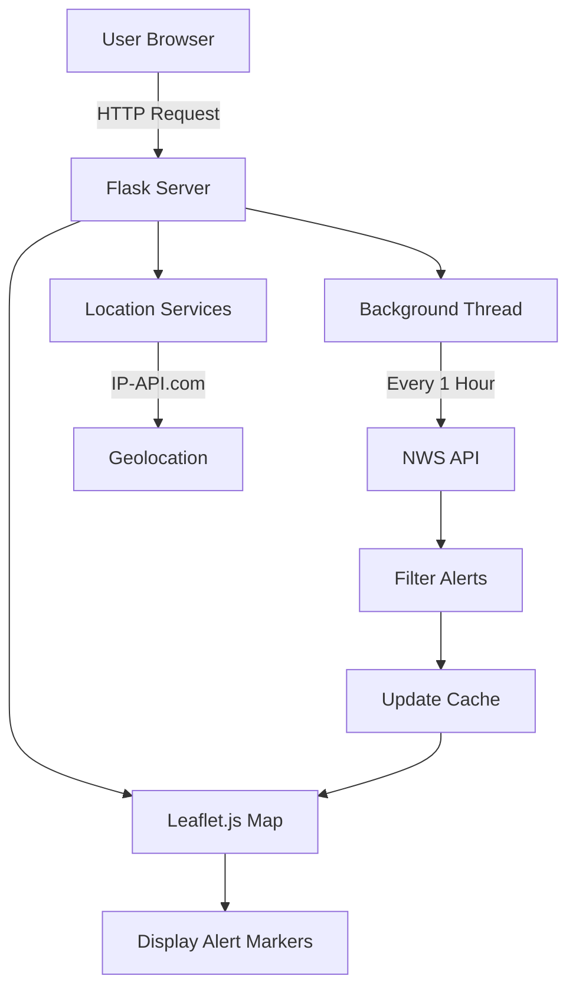

<h1 align="center">🔥 <a href="https://github.com/ronknight/firemon">Fire Alert Monitor</a></h1>
<h4 align="center">🌐 Real-time wildfire tracking system with Leaflet.js maps</h4>

<p align="center">
  <a href="https://twitter.com/PinoyITSolution"></a>
  <a href="https://github.com/ronknight?tab=followers"></a>
  <a href="https://github.com/ronknight/firemon/stargazers"></a>
  <a href="https://github.com/ronknight/firemon/network/members"></a>
  <a href="https://youtube.com/@PinoyITSolution"></a>
  <a href="https://github.com/ronknight/firemon/issues"></a>
  <a href="https://github.com/ronknight/firemon/blob/main/LICENSE"></a>
  <a href="https://github.com/ronknight"></a>
</p>

<p align="center">
  <a href="#features">Features</a> •
  <a href="#installation">Installation</a> •
  <a href="#usage">Usage</a> •
  <a href="#api-integration">API Integration</a> •
  <a href="#visualization">Visualization</a> •
  <a href="#security">Security</a> •
  <a href="#disclaimer">Disclaimer</a>
</p>

---

## 🌟 Features
- Real-time NWS alert monitoring for California
- Automatic IP-based location detection
- Interactive map visualization with Leaflet.js
- Manual location override capabilities
- Background data refresh (1-hour intervals)
- Responsive web interface
- Alert filtering for:
  - Wildfires
  - Evacuation orders
  - Red flag warnings

---

## 🛠️ Installation
```bash
git clone https://github.com/ronknight/firemon.git
cd firemon
pip install -r requirements.txt
```

---

## 🖥️ Usage
1. Start the Flask server:
```bash
python3 app.py
```
2. Access the web interface at `http://localhost:8000`

**Manual Location Configuration**:
- Submit county/city/ZIP via web form
- Map automatically centers on specified location

---

## 🔌 API Integration
```python
import requests

# Get active alerts
response = requests.get("http://localhost:8000/alerts")
alerts = response.json()

# Update map center
requests.post("http://localhost:8000/update_map_center", json={
    "map_center": [34.0522, -118.2437]  # LA coordinates
})
```

---

## 🗺️ Visualization Architecture


---

## 🔒 Security Features
> **Important**  
> - Custom User-Agent header for API compliance
> - Rate-limited API retries (3 attempts with exponential backoff)
> - Input validation for location data
> - No persistent user data storage
> - Built-in request timeout handling

---

## ⚠️ Critical Disclaimer
```text
This system provides informational alerts ONLY. Always:
- Verify with official emergency services
- Follow evacuation orders immediately
- Maintain multiple alert notification methods

NWS data may contain delays - do not rely solely on this system
for life-saving decisions. Use at your own risk.
```

---

## 📂 Repository Structure
```
firemon/
├── app.py            # Main application logic
├── requirements.txt  # Python dependencies
├── templates/
│   └── index.html    # Web interface template
├── static/
│   ├── js/
│   │   └── map.js    # Javascript
│   └── style.css     # Stylesheets
├── LICENSE
└── README.md
```

[](https://open.vscode.dev/ronknight/firemon)