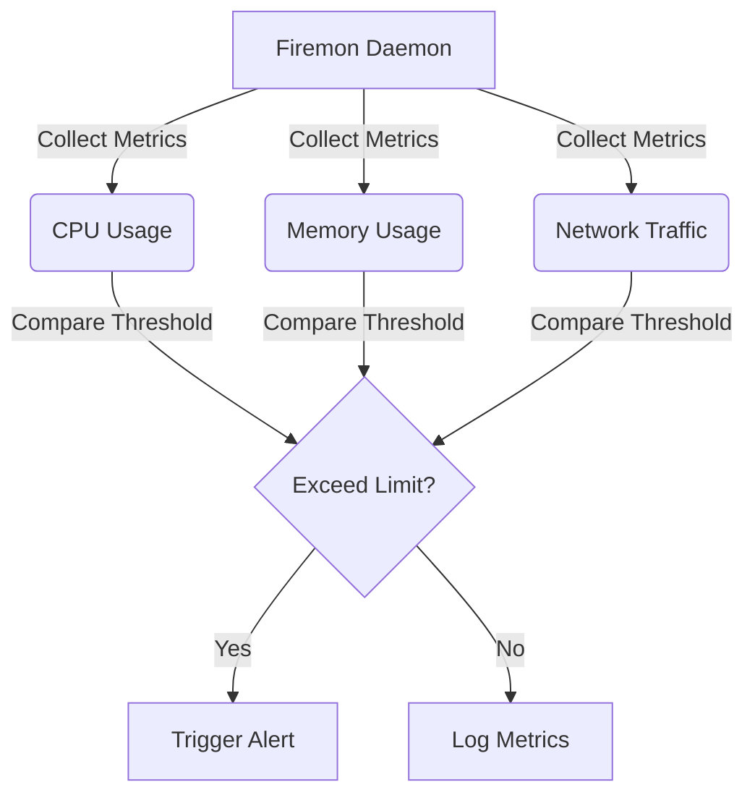

<h1 align="center">🔥 <a href="https://github.com/ronknight/firemon">Firemon</a></h1>
<h4 align="center">🔍 Python-based system monitoring and alerting utility.</h4>

<p align="center">
  <a href="https://twitter.com/PinoyITSolution"></a>
  <a href="https://github.com/ronknight?tab=followers"></a>
  <a href="https://github.com/ronknight/firemon/stargazers"></a>
  <a href="https://github.com/ronknight/firemon/network/members"></a>
  <a href="https://youtube.com/@PinoyITSolution"></a>
  <a href="https://github.com/ronknight/firemon/issues"></a>
  <a href="https://github.com/ronknight/firemon/blob/master/LICENSE"></a>
  <a href="https://github.com/ronknight"></a>
</p>

<p align="center">
  <a href="#system-overview">System Overview</a> •
  <a href="#features">Features</a> •
  <a href="#installation">Installation</a> •
  <a href="#configuration">Configuration</a> •
  <a href="#alerts">Alerts</a> •
  <a href="#visualization">Visualization</a> •
  <a href="#security">Security</a>
</p>

---

## 🛠️ System Overview
Real-time monitoring tool designed to track system metrics (CPU, memory, network) and trigger customizable alerts.

---

## ⚙️ Installation
```bash
git clone https://github.com/ronknight/firemon.git
cd firemon
pip install -r requirements.txt
```

---

## 📂 Configuration
1. Edit `config.yaml`:
```yaml
monitoring:
  interval: 60  # Seconds between checks
  thresholds:
    cpu: 90%    # Alert if CPU > 90%
    memory: 80% # Alert if memory > 80%
```

---

## 🚨 Alerts
Run with custom thresholds:
```bash
python3 firemon.py --cpu 85 --memory 75
```

---

## 📊 Visualization


---

## 🔐 Security
> **Warning**  
> - Ensure proper firewall rules for network monitoring  
> - Restrict config file permissions (chmod 600 config.yaml)  
> - Do not run as root unless required

---

## ⚠️ Disclaimer
This tool monitors system resources but cannot prevent hardware failures. Use at your own risk. Always maintain backups.

<sub>⚠️ Monitoring intervals may vary based on system load.</sub>